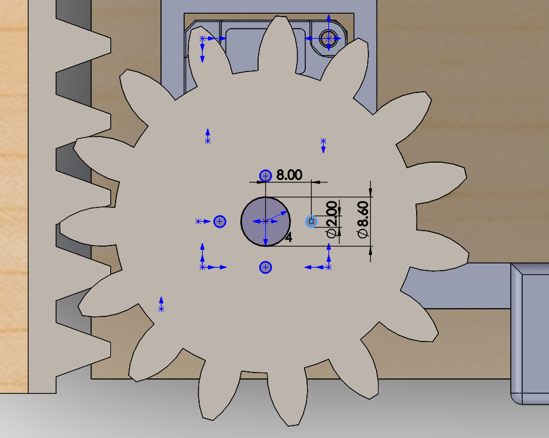
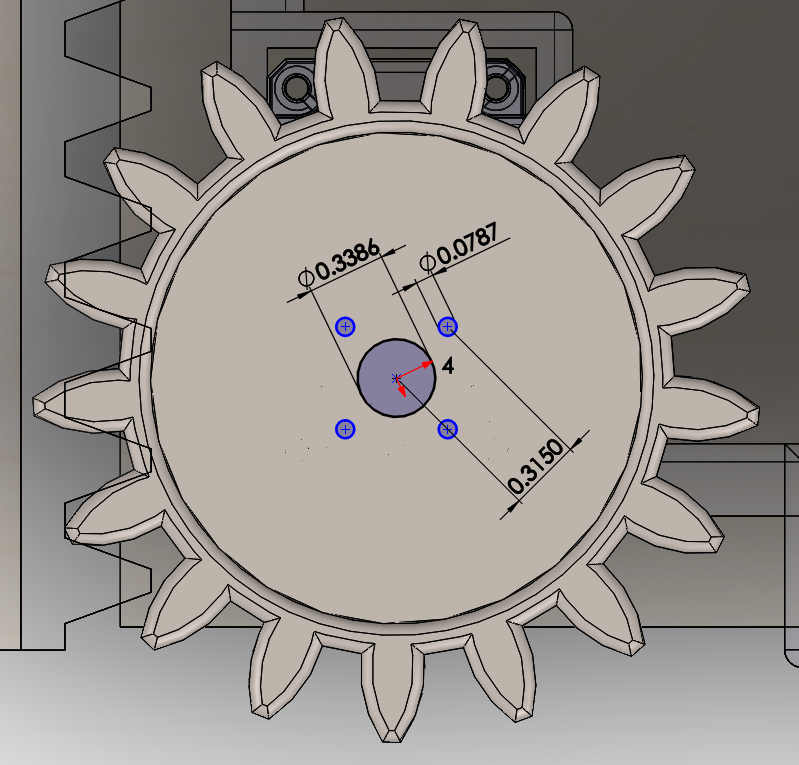
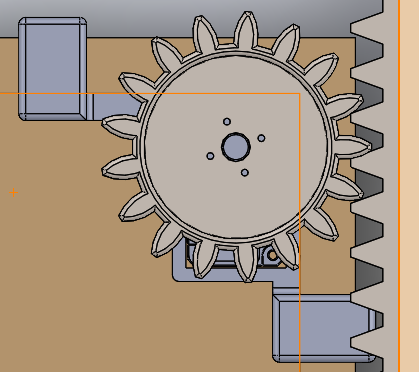
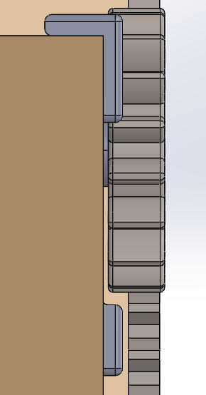
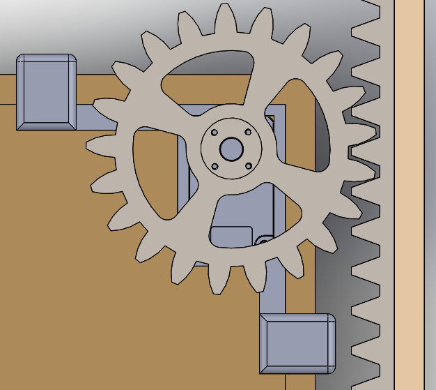
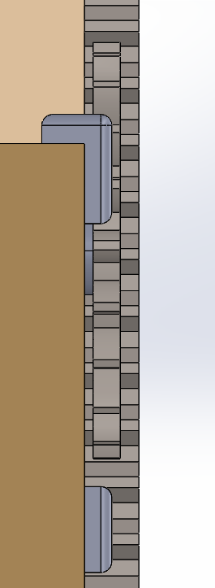

> Last edited: 17-04-20 by Charles Maheu
> Author: Charles Maheu
> 
# Automatic drawer mechanism
The mechanic assembly is based on the [XM430-W350-T Dynamixel smart actuator from Robotis](http://emanual.robotis.com/docs/en/dxl/x/xm430-w350/). The motor provides plenty of torque, as well as feedback on the force, the speed and the position which allows for easier control. To sum up, it presents itself as a reliable, although very expensive solution.

## Drawer mechanism setup
### 1. Drawer CADs
#### 1.1. Measuring
Here's a list of the measures that need to be known in order to modify this drawer and the rest of the CAD :

- **Drawer_to_sidewall** : Distance between the drawer and the side wall
- **Drawer_side_tickness** : Thickness of the drawers walls
- **Drawer_top_clearance** : Minimal height clearance with top drawer's front
- **Drawer_length** : Length of the drawer (for the rack)
- **Drawer_to_back_wall** : Distance between the drawer and the back wall**

> ** 5mm is substracted from this distance within the CAD to allow enough space to place for the sensor and a fridge magnet to fit. Use the real distance available as input for this variable.
> Also, some wires will have to be fixed behind the drawer. This may require more 

#### 1.2. Modifying the CADs
> Before opening the CAD assembly in Solidworks, you must tell Solidwork to use the modified spur gears. For that purpose, uncheck the box "_Make this folder the default search location for Toolbox components_" in the **Hole Wizard/Toolbox** section of the settings. ([ref.](https://forum.solidworks.com/thread/78786))

Most of the modification can happen in the assembly directly. The measures taken precendently will be used to update the global variables.
1. Open equation settings with ```Manage equations``` by right-clicking on ```Equations``` on the left side-panel.
2. Update the value of each necessary variable.
3. If necessary, remake a new gear for proper fitting. More information below.
4. Adjust the variables for the *gear clearance* on the motor support and the *motor attach tickness* according to the available space left.

#### 1.3. Remaking the gear
Due to limitation with the way gears are made in Solidwork's Toolbox, it's impossible to adjust the diameter of a gear directly. The only possible adjustements are with the number of tooths and the size of them. Modifying the size of teeths would require more work to adjust the rack to fit the new gear. This leaves only the option of teeth numbers. This option, as simple as it sounds, requires to edit the Toolbox component and redo all the holes and adjustements that make it possible to fix the gear directly on the motor's shaft.
If necessary, here are the steps to do that : 

1. Make sure Solidwork's Toolbox addon is loaded by going on the right side menu, clicking on `Design Library`, then clicking on `Toolbox` and finally `Add in now` at the bottom if it wasn't added.
2. Rigth-click on the gear component in the component tree and select `Edit Toolbox components`. Solidworks will probably ask to rebuild the gear, which must be done to continue.
3. Change the number of teeth according to what fits best. Adjust the thickness of the gear too. Confirm the changes.
4. Open the component by right-clicking and then clicking `Open the part`. It must be saved while keeping all references.
5. Edit the gear to add these features : 

|Additionnal gear features to add||
|-|-|
|**1. Middle hole** |Centered, 8.6mm |
|**2. Screw hole** |8mm center-to-center with the middle hole, 2mm |
|**2.2. Repeat pattern** |Circular Sketch pattern x4 around center|
|**3. Remove matter** |Cut-Extrude : 3mm Offset from bottow surface|

| mm :| inches :|
|-|-|
|||

6. The assembly should update itself. Some *Mates* might need to be fixed.

#### 1.4. Heavier CAD modifications
Depending on the spacing available in the target drawer, it's possible to modify how the gear, the rack and the support assemble manually to make the device fit different types of drawers. An exemple of what can be done is shown below : 

|Type| Advantage | Top view | Side view |
|-|-|-|-|
| **Default** or narrow | **Allows for very small distance between the sidewall and the drawer.** This space is only needed to fit the attach from the motor support.| ||
|**Thinner**| **Allows for a very small distance between the top of the drawer's sides and any obstables** while being sligthly wider. This is achieved by making the gear larger and thinner and the rack thinner and positionned lower. *The larger gear makes it possible for the rack to not intersect the support and thus require to be placed higher than the support.* |||

### 2. Printing components
The parts can be 3D printed from the previously modified CADs. Most of those parts may be subject to non-negligible stress from daily use and it is highly suggested the parts are printed with a good infill value to avoid problems. Support must aslo be used to ensure the parts print correctly.
The rack must, in most cases, be splitted into two different parts since most printers can't print objects of this length.

### 3. Assembling components
1. The smart actuator must be properly screwed-in using M2.5 screws in the holes provided for this purpose. The screws that come with the motor were used in our tests.
2. The gear should be screwed in the motor using included screws.
3. The rack should be carefully mounted on the inside of the drawer unit to match with the height of the gear. It sould be mounted with thin double sided tape, but it can also be temporarily fixed using blu tack. Both part of the rack should be installed with minimal gap between them. They can also be glued together if needed.
4. The motor support can then be installed. To ensure it doesn't move when using it, a piece of elastic or rubber can be inserted between the side of the drawer and the fixation point on the motor support. Without this, undesired movement was observed while testing in certain cases.
